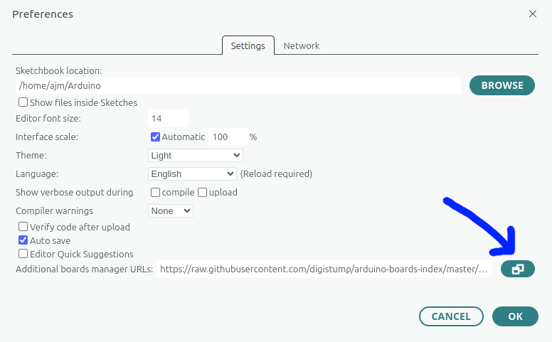
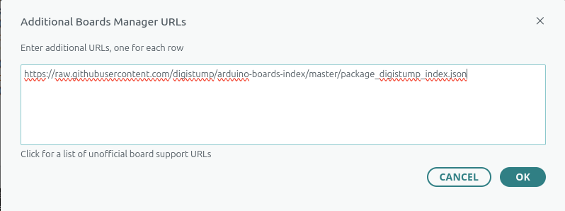
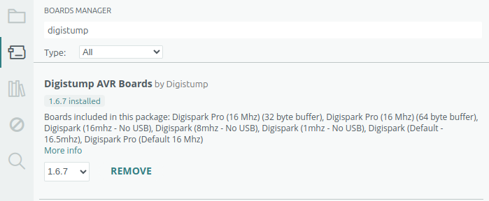
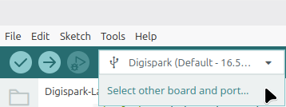
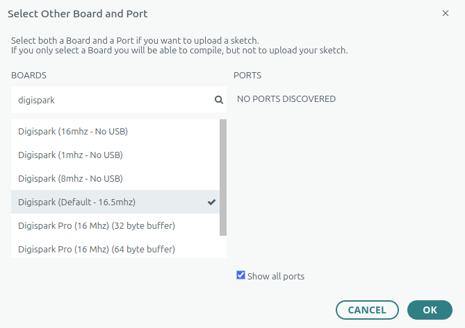
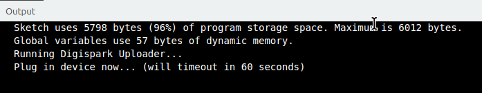
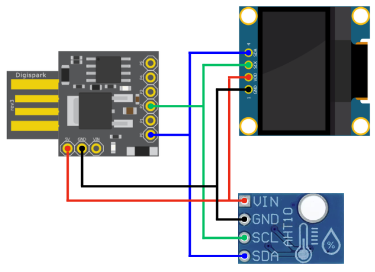
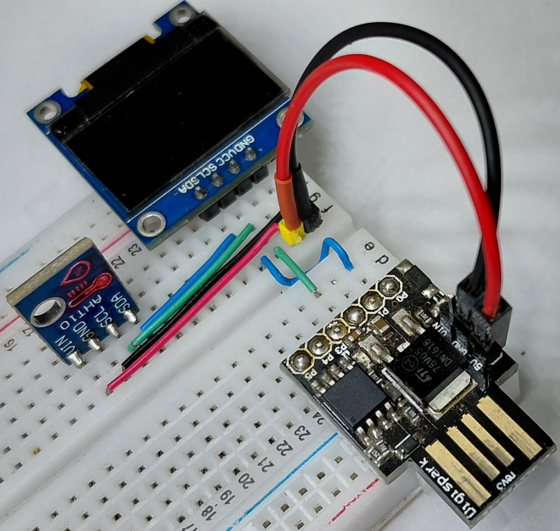
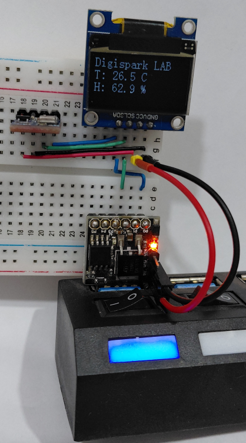
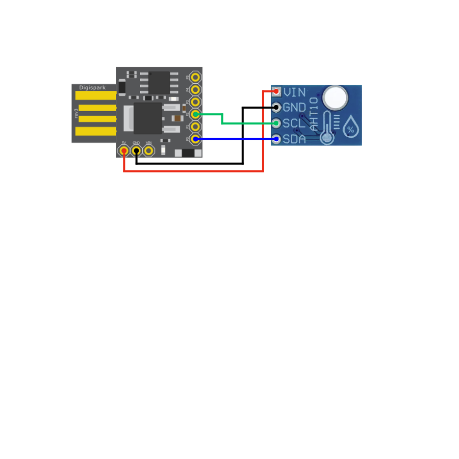

# 🚀 Digispark Lab


<br>
<!-- <br> -->
<!--  -->
<!--  -->

# 3 projetos 
 1. Temperatura e umidade no LCD
 2. Temperatura interna com interface Python
 3. Temperatura externa com conexão bluetooth com inteface Python


> Ambiente completo de desenvolvimento Digispark em Linux Mint, com Micronucleus, regras udev, configuração do Arduino IDE e projetos exemplos.


## ✨ Sobre

Este repositório reúne:

- Configuração do Digispark (ATtiny85) no Linux
- Instalação e uso do bootloader `Micronucleus`
- Regras `udev` para acesso USB sem permissão root
- Passo a passo no Arduino IDE


- **Projeto Digispark usando AHT10 para mostrar temperatura e umidade no SSD1306.**

## 🧩 Hardware suportado

| Item | Detalhes |
|---|---|
| Placa | Digispark ATtiny85 (16.5 MHz) |
| Display | OLED SSD1306 (I²C) |
| Sistema | Linux Mint 22.3 / Ubuntu 24.04 |
| Interface | I²C |

## 🚀 O que você encontra aqui

- Guia de instalação do Digispark no Arduino IDE
- Setup do Micronucleus no Linux
- Regras `udev` para acesso ao dispositivo
- Testes de detecção com `lsusb`
- Procedimento correto de upload
- Exemplo de uso com display OLED SSD1306

## 🛠️ Pré-requisitos

- Linux Mint 22.3 ou Ubuntu 24.04
- Arduino IDE 2.x
- Digispark com bootloader Micronucleus
- Biblioteca `DigisparkOLED`

## ✅ Rápido começo

1. Instale o Digispark Board no Arduino IDE
2. Instale o `Micronucleus`
3. Adicione a regra `udev`
4. Compile e faça upload com o Digispark desconectado
5. Conecte o Digispark quando a IDE pedir

---

## 📥 Instalação do Digispark no Arduino IDE

1. Abra o Arduino IDE
2. Vá em `File > Preferences`



3. No campo **Additional Boards Manager URLs**, adicione:

```text
https://raw.githubusercontent.com/digistump/arduino-boards-index/master/package_digistump_index.json
```


4. Abra `Tools > Board > Boards Manager`
5. Busque por `Digistump AVR Boards`


6. Instale o pacote

> Após a instalação, selecione a placa `Digispark (Default - 16.5 MHz)`.<br>
<br>

---

## ⚠️ Observação importante

O Digispark **não cria uma porta serial** como Arduino Uno ou ESP32.

Você não verá:

```text
/dev/ttyUSB0
/dev/ttyACM0
```

Isso é normal. O upload usa o **bootloader Micronucleus** via USB.

---

## 🧰 Instalação do Micronucleus (Linux)

Execute:

```bash
sudo apt update
sudo apt install git build-essential libusb-dev
```

Clone o repositório do Micronucleus:

```bash
git clone https://github.com/micronucleus/micronucleus.git
```

Compile e instale:

```bash
cd micronucleus/commandline
make
sudo make install
```

---

## 🔧 Configuração da regra `udev`

Sem a regra, você pode ver erro:

```text
usb_open(): Permission denied
```
LCD
Instale a regra com:

```bash
sudo wget -O /etc/udev/rules.d/49-micronucleus.rules \
  https://raw.githubusercontent.com/micronucleus/micronucleus/master/commandline/49-micronucleus.rules
```

Recarregue as regras:

```bash
sudo udevadm control --reload-rules
sudo udevadm trigger
```

Reconecte o Digispark.

---

## 🔍 Teste do Micronucleus

Execute:

```bash
micronucleus --info
```

Saída esperada:

```text
Device is found!
Device has firmware version 1.6
Available space for user applications: 6012 bytes
```

---

## 🔌 Verificando o dispositivo USB

Use:

```bash
lsusb
```

Você deve ver algo parecido com:

```text
Bus 001 Device XXX:
ID 16d0:0753
Digistump DigiSpark
```

---

## 📤 Procedimento de upload

O fluxo de upload do Digispark é diferente do Arduino tradicional:

1. Pressione **Upload** no Arduino IDE
2. Aguarde a mensagem:

```text
Plug in device now... (will timeout in 60 seconds)
```
<br>

3. Conecte o Digispark ao USB
4. Aguarde o término do upload

> Não é necessária nenhuma porta serial para este processo.

---


# 1. Temperatura e umidade no LCD

## [Código: ATH10-LCD.ino](firmware/ATH10-LCD/ATH10-LCD.ino)

## 🖥️ Conexão do OLED SSD1306 e AHT10

| OLED | Digispark | AHT10 |
|---|---|---|
|  5V | VCC | VCC |
| GND | GND | GND |
| P0 | SDA | SDA |
| P2 | SCL | SCL |


## Esquema eletrônico
<br>

## No protoboard

<br>


# 2. Temperatura e umidade no Python

## [AHT10-UART-python.ino](firmware/AHT10-UART-python/AHT10-UART-python.ino)

## 🖥️ Conexão do OLED SSD1306 

| OLED | Digispark |
|---|---|
|  5V | VCC |
| GND | GND |
| P0 | SDA |
| P2 | SCL |


## Esquema eletrônico



Para o python
pip install pyserial
sudo usermod -a -G dialout $USER
sudo chmod 666 /dev/ttyACM0


Biblioteca sugerida:

```text
DigisparkOLED
```

### Exemplo básico

```cpp
#include <DigisparkOLED.h>
#include <Wire.h>

void setup() {
  oled.begin();
  oled.clear();

  oled.setFont(FONT8X16);
  oled.setCursor(0, 0);
  oled.print(F("DIGISPARK OK"));

  oled.setFont(FONT6X8);
  oled.setCursor(0, 2);
  oled.print(F("SSD1306 I2C"));
}

void loop() {
  // Adicione seu código aqui
}
```

---

## 📚 Recursos úteis

- `https://github.com/digistump/arduino-boards-index`
- `https://github.com/micronucleus/micronucleus`
- Biblioteca `DigisparkOLED`

---

## 📄 Licença

MIT License


# Useful Commands

List USB devices

```bash
lsusb
```

Monitor USB events

```bash
dmesg -w
```

Check Micronucleus

```bash
micronucleus --info
```

---

# Notes

The Digispark:

- does not expose a USB serial port;
- uses the Micronucleus bootloader;
- is programmed directly through USB;
- requires reconnecting after pressing Upload;
- works perfectly on Linux after installing Micronucleus and the udev rule.

---

# Planned Experiments

- [x] Linux setup
- [x] Micronucleus
- [x] OLED SSD1306
- [x] Temperature sensor
- [x] Humidity sensor
- [ ] USB communication with Python
- [ ] DigiKeyboard
- [ ] DigiMouse
- [ ] USB HID projects


# Common Mistakes

## No serial port appears

This is normal.

The Digispark does not expose a USB CDC serial port.

---

## "NO PORTS DISCOVERED"

This is normal.

The Digispark is programmed through Micronucleus and does not require selecting a serial port.

---

## usb_open(): Permission denied

Install the Micronucleus udev rule.

---

## Digispark not detected

Check:

- USB cable
- Micronucleus installation
- udev rule
- `lsusb`

#### Exemplo
No terminal digite:
```bash
lsusb | grep -i digispark
```

Resposta esperada: 
```bash
Bus 001 Device 007: ID 16d0:0753 MCS Digistump DigiSpark
```

e para mais informações
```bash
lsusb -v -d 16d0:0753
```

Resposta esperada: 
```bash
Bus 001 Device 007: ID 16d0:0753 MCS Digistump DigiSpark
Device Descriptor:
  bLength                18
  bDescriptorType         1
  bcdUSB               1.10
  bDeviceClass          255 Vendor Specific Class
  bDeviceSubClass         0 [unknown]
  bDeviceProtocol         0 
  bMaxPacketSize0         8
  idVendor           0x16d0 MCS
  idProduct          0x0753 Digistump DigiSpark
  bcdDevice            1.06
  iManufacturer           0 
  iProduct                0 
  iSerial                 0 
  bNumConfigurations      1
  Configuration Descriptor:
    bLength                 9
    bDescriptorType         2
    wTotalLength       0x0012
    bNumInterfaces          1
    bConfigurationValue     1
    iConfiguration          0 
    bmAttributes         0x80
      (Bus Powered)
    MaxPower              100mA
    Interface Descriptor:
      bLength                 9
      bDescriptorType         4
      bInterfaceNumber        0
      bAlternateSetting       0
      bNumEndpoints           0
      bInterfaceClass         0 [unknown]
      bInterfaceSubClass      0 [unknown]
      bInterfaceProtocol      0 
      iInterface              0 
```


